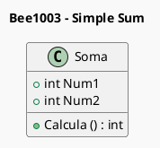
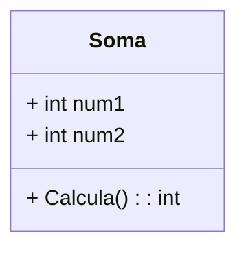

# BeeCrowdProblems
Exercícios e problemas com Beecrowd

```plantuml
@startuml
!theme mars
Title Bee1003 - Simple Sum

class Soma{
  + int Num1
  + int Num2
  + Calcula () : int
  
}
@enduml
```

```mermaid
---
Title: Bee1003
---
classDiagram
class Soma{
    + int num1
    + int num2
    + Calcula(): int
}
```
