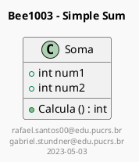
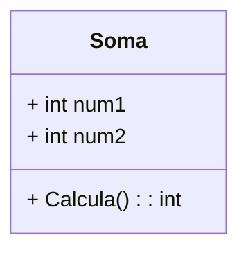

# BeeCrowdProblems
Exercícios e problemas com Beecrowd

## Código do PlantUML



## Imagem do PlantUML

<p align="center">
  
</p>

## Gerado o mesmo diagrama pelo Mermaid

```md
classDiagram
class Soma{
    + int num1
    + int num2
    + Calcula(): int
}
```



## Diagrama de Atividades


